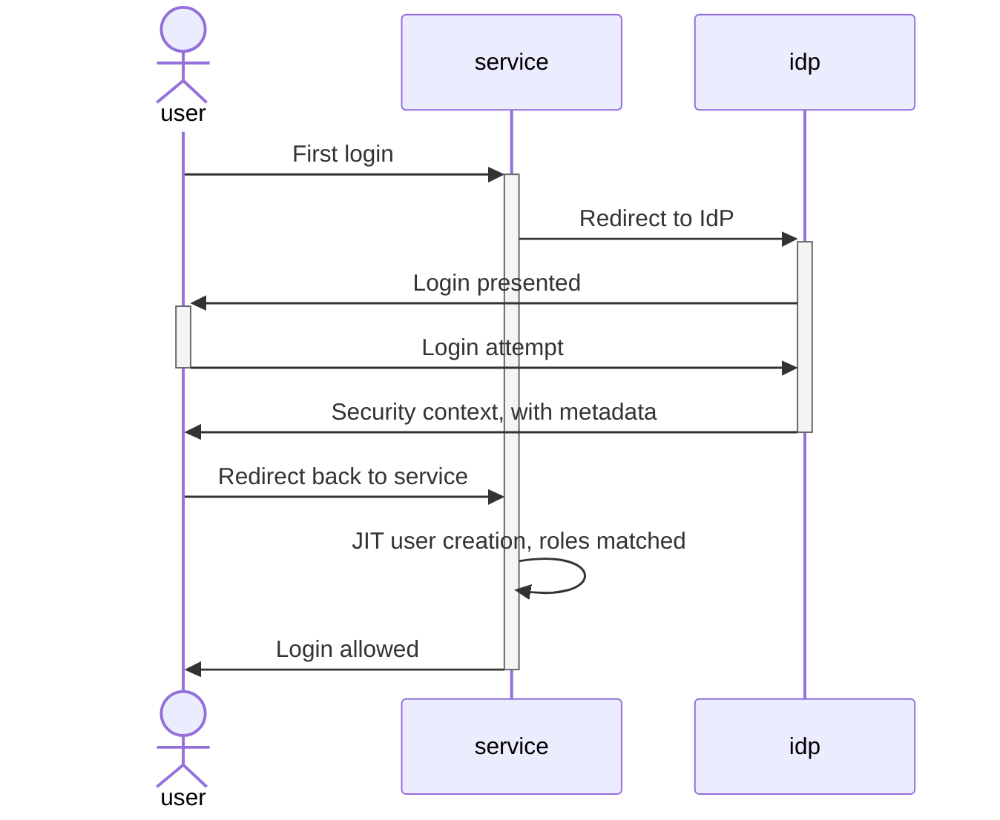
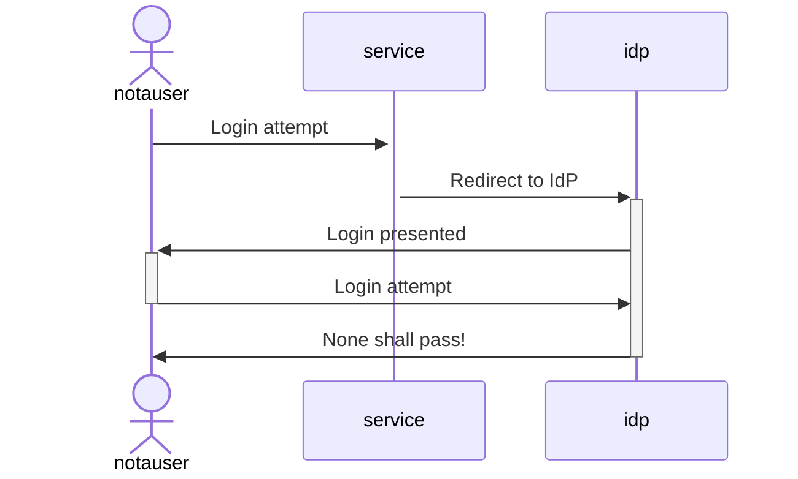
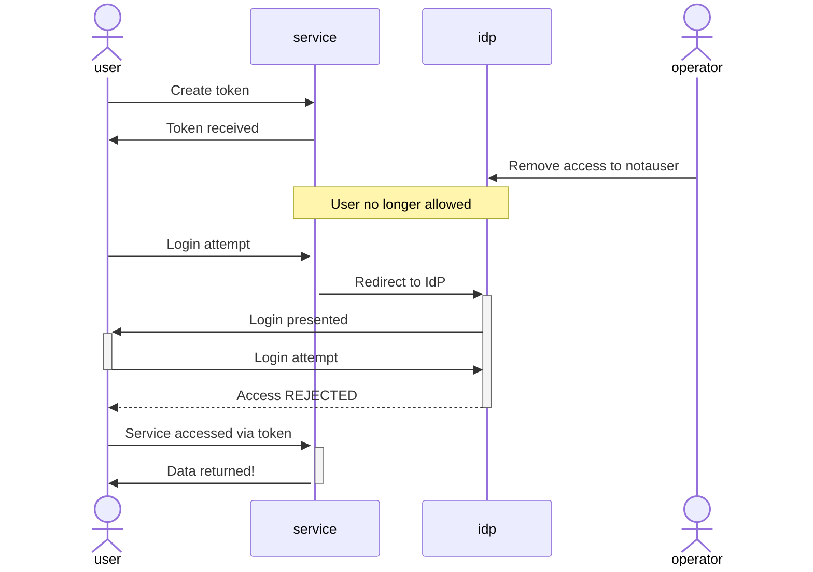

Using an external identity provider (IdP) through SAML is a straightforward and common
way to manage user access to services for organizations.

Many proprietary and open source projects support this method of integration,
and most of the big names in the IdP sphere such as Okta, Auth0, and others provide 
you the tools to leverage this approach.

By using this setup you avoid having to otherwise create and manage users in
many different services, which would otherwise become unwiedly.  
Roles as well can be defined at the IdP side and referenced with the service itself.  

This is convenient and provides an abstraction of *how* you defined access to
a system separately from *who* is given access.  It's a good thing, and
makes it easy to keep tabs on what is allowed to be done against a
system.

By having roles defined in this way as well it's simple to take a user from a
limited onboarding role, to a full user role, possibly an admin/power user
role, and eventualy to remove access.

---

Sounds perfect, right?

Well, there may be a bit of a catch.

---

# SAML JIT User Onboarding
First let's backup and take a look at what happens when a user is
onboarded via a SAML connection.

We will assume that the service in question is already properly configued and
integrated with the IdP in use.  We will also assume that the user is already
setup and configured in the IdP.

Here is a simplified example of the flow:

Subsequent logins to the service will not have to re-create the user, however
metadata about the user will flow from the IdP as roles and permissions
change.

# Mapping Roles

First we will assume that on the IdP side our user management team has created roles such 
as `onboarding_user`, `standard_user`, and `management`.
New hires are given a role of `onboarding_user` for the first 30 days, then
transitioned to `standard_user`.  Managers are given the role of `management`.

Over on the service side our operator would have created roles such as
`readonly_access`, `readwrite_access`, `admin_access`.  A mapping is then
created in the service so that SAML provided roles are mapped to internal
roles like so:

* onboarding_user -> readonly_access
* standard_user -> readwrite_access
* management -> admin_access

This approach allows allows the service operator to determine exactly what access means in terms of
the features present in the service itself.

It's a nice separation of concerns.

# SAML Offboarding

When a user leaves our organization, we need to be able to remove access to
all systems and roles granted to that user.  Luckily we can easily remove or
restrict user access in our IdP which will prevent subsequent logins to our
systems.

This works like we suspect and is all well and good.  The user login attempt
was rejected as we expected.  Controlling user access
through the IdP allows us to restrict access with a single turn of a knob,
which is what we want.

So what's the problem?

# User Tokens

It's not uncommon for services to allow the creation of tokens for access to
various resources.  This is very useful, if not necessary, when integrating via an API, for
integration of client side tooling for workflow, and countless other use
cases.

Typically these tokens are created and managed by the user account by the user
themselves, and have the set of permissions granted to that user.

The tokens themselves, however, are entirely outside of the scope of the IdP itself.

# Service Offboarding

When a user is disabled via an IdP that was created via just in time
provisioning as described, there is typically
nothing built into this flow that removes the user from the service side
itself.

That means that while a user may no longer be able to login through the
front-door to a system through the IdP, unless explicity steps are taken
during offboarding, or via service auditing, a removed user could easily have
token access with whatever permission they had previously been granted!  If
that user has previously granted the `admin_access` role above you may be in
some real trouble.

Some IdP providers do actually wrap service integration to a certain degree
and explicitly add in steps for off-boarding, but that is *not* a standard
part of SAML JIT. 

Most straight SAML setups of services that allow token creation are likely
vulnerable to just this kind of oversite.  Just in time provisioning is not
necessarilly limited to SAML user creation either, other methods such has
Oauth2 may have similar concerns.

# How to Handle Offboarding?

Is SSO via an IdP junk and you should avoid SAML altogether?  Not
necessarilly (though I would encourage you to look into OIDC -- future article forthcoming.)

To start, consider the full user lifecycle for each of your integrated
services.  Don't just setup SAML and forget about it.  Your IdP may or may not
make this process more convenient.  Understand those features, implement them,
and _validate_ the flows.

Some IdPs may provide the hooks for offboarding that you need to fill out.  Definitely leverage this if it's available.

Ultimately though, good management of your services, accesses, and ACLs,
should involve regular internal auditing and alerting.

The best way to resolve an assumption is often to simply check!
